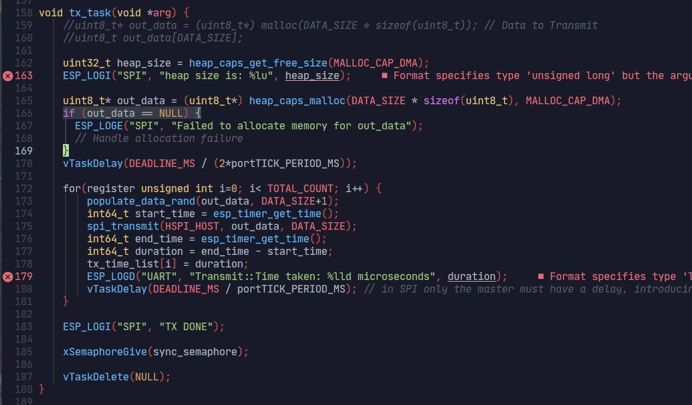
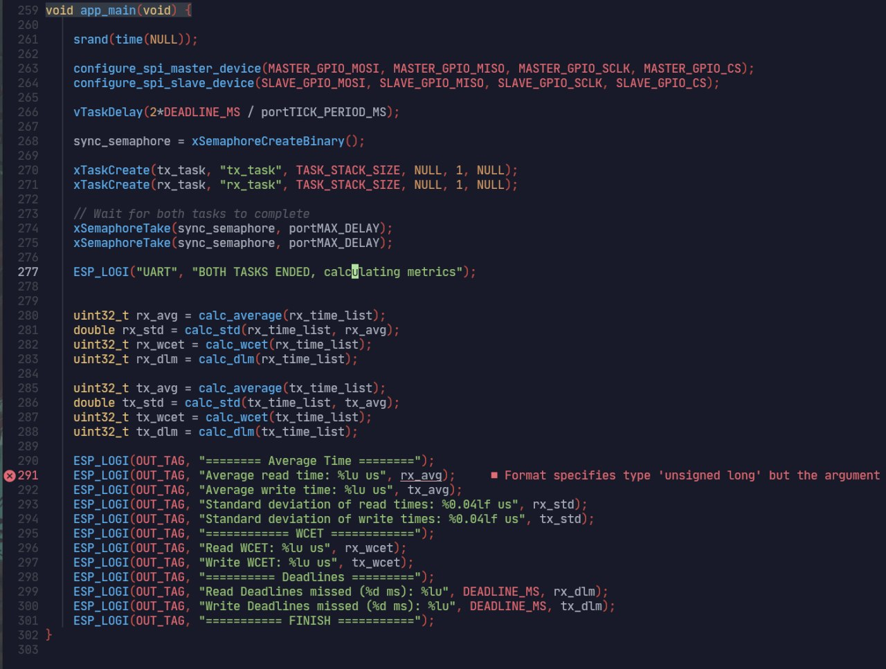
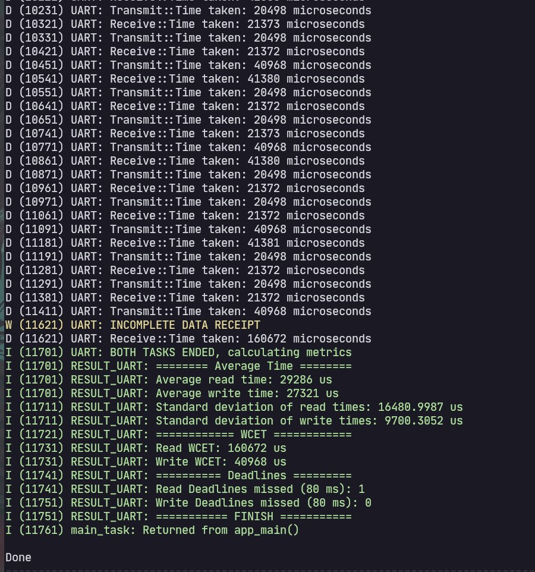
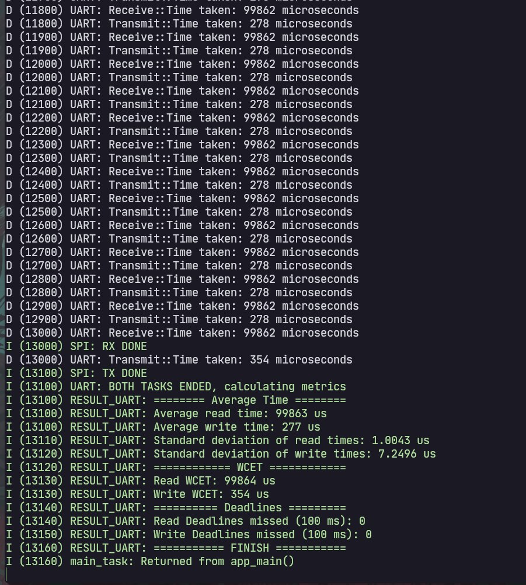
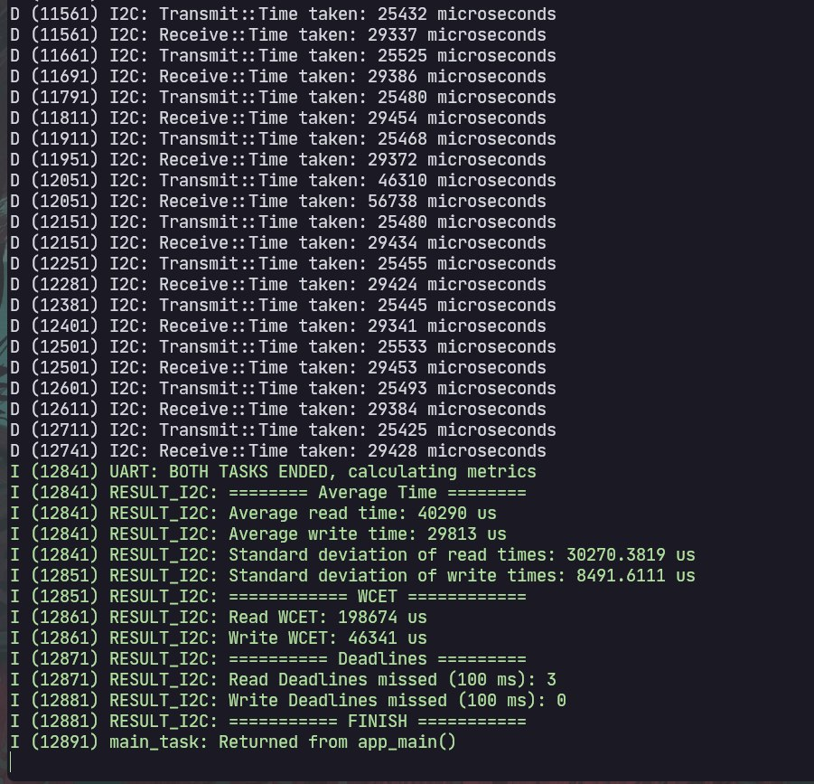
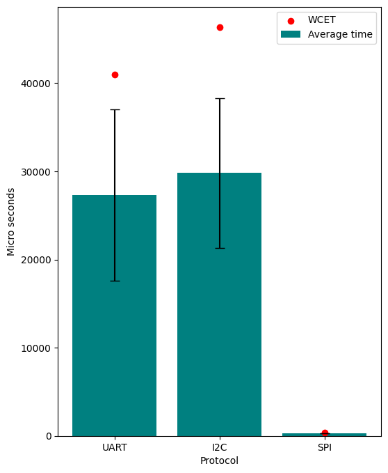

# Creating an embdedded system's benchmark (communication)

This project was done for a hardware lab module in sharif university of technology. The purpose of the project is creating a benchmark for testing communication protocols like UART, I2C, and SPI in embedded systems. The implementation was done with the ESP32 board in mind and the chosen coding platfrom was ESP-IDF.


## Tools
In this section, you should mention the hardware or simulators utilized in your project.
- ESP32
- ESP-IDF


## Implementation Details

Each communication protocol comes with its own project. The projects utilize FreeRTOS' ability to manage two devices at once.

At the beginning of each project, two devices on the board (for example, UART0 and UART1) are configured with the appropriate parameters. For example in the SPI case, one of the devices is configured as the master and the other one as the slave. Other configurations, like baud rate, frequency, and addresses also take place in this section.

Subsequently, two RTOS tasks are created, one for data transmission and one for recieving. RTOS handles multithreading and multicore functionalities as needed. 

These tasks exist to simulate two separate devices. Our scenario simulates a real time application with a deadline. At the start of each simulation round, a certain amount of random data is created and then transmitted to the reciever. The time of each phase of the process is accurately measured and logged. For the UART protocol, which is symmetric, an additional signaling method has been implemented.

The two tasks work together to make sure that both device controllers stay active and the transmission persists until all the data has been transferred.

Variables like the task deadlines, the amount of data to be transferred, and the number of simulation rounds, can be changed in the project configuration phase.

After all the transmissions are done, the RX and TX times are used to calculatd the average, standard deviation, and worst case execution times.

Example of a TX task:



- Initially a buffer is allocated. In this particular example the fact that it is allocated in a DMA accessible heap region is important due to specifications of the SPI driver.
- Afterwards, in the simulation loop, the data is initialized and the timer starts. During this time, the *_transmit function implements the protocol specific logic for clear and safe transmission of data.
- When the function returns, the timer stops and the duration is computed and stored for later use.

Example of a main function:



- This task highlights the attempt at modularity that was part of our main objectives in implementing this project. To adapt the code for a new protocl, the configuration and transmission functions need to be implemented with respect to that procotol, but the tasks and the main function should be able to work the same way.

## How to Run

- Follow the installation link to install the ESP-IDF framework. From this point forward, we will assume you have installed the framework under ~/esp/esp-idf/

- Activate environment by running
```bash
~/esp/esp-idf/export.sh
 ```
if you run into any problems at this step, please check out the installation toturial provided by the framework.

- Clone the repository and navigate to the project folder

- If this is your first time running this code, run
```bash
python idf.py set-target esp32
```

- Run 
```bash
python idf.py menuconfig
```
and configure the project. Be sure to save when you're done.

- Make sure the connections on the board are all correct, and conncet the board to your computer

- Look in the /dev folder to find your esp32 device (typically in a directory like /dev/ttyUSB0)

- Run
```bash
python idf.py -p {block device address} flash monitor
```
(You may need to run chmod to allow idf.py to access the block device)


## Results
As expected, the SPI protocol vastly outperforms its counterparts. The read time is not comparable due to the nature of the SPI protocol, but we can compare and plot the write times. <br />
- UART results <br />

- SPI results <br />

- I2C results <br />


This plot aptly illustrates the results and how they compare: <br />



## Related Links
Some links related to your project come here.
 - [esp-idf installation](https://docs.espressif.com/projects/esp-idf/en/stable/esp32/get-started/linux-macos-setup.html)
 - [esp-idf i2c](https://docs.espressif.com/projects/esp-idf/en/v5.4/esp32/api-reference/peripherals/i2c.html#introduction)
 - [esp-idf spi master](https://docs.espressif.com/projects/esp-idf/en/v5.4/esp32/api-reference/peripherals/spi_master.html)
 - [esp-idf spi slave](https://docs.espressif.com/projects/esp-idf/en/v5.4/esp32/api-reference/peripherals/spi_slave.html)
 - [esp-idf uart](https://docs.espressif.com/projects/esp-idf/en/v5.4/esp32/api-reference/peripherals/uart.html)


## Authors
Authors and their github link come here.
- [@NegarAskari](https://github.com/NegarAskari)
- [@HiradDavari](https://github.com/theAester)

